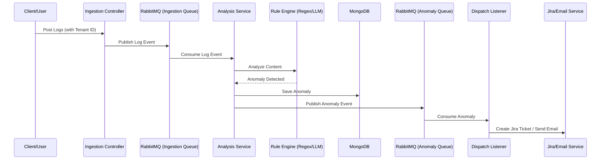

# Java Log Analyzer: Project Features & Architecture

This project is a multi-tenant log analysis and incident automation platform. It ingests logs, detects anomalies using both rule-based and AI-driven engines, and automatically creates tickets or notifications.

## Key Features

1.  **Multi-Tenant Ingestion API**:
    *   Exposes REST endpoints for log submission.
    *   Supports tenant-specific contexts using `X-Tenant-ID`.
    *   Handles file uploads and processes them line-by-line.
2.  **Asynchronous Processing Pipeline**:
    *   Uses **RabbitMQ** to decouple log ingestion from analysis and dispatching.
    *   Ensures scalability and fault tolerance by queuing log events and anomalies.
3.  **Hybrid Anomaly Detection Engine**:
    *   **Regex Rule Engine**: Fast, deterministic detection of known patterns (e.g., "Exception", "ERROR").
    *   **LLM Rule Engine (AI-Powered)**: Leverages Large Language Models to detect subtle, complex, or unknown anomalies that traditional patterns might miss.
4.  **Automated Incident Management**:
    *   **Jira Integration**: Automatically creates Jira tickets for detected anomalies.
    *   **Notification System**: Sends email notifications to relevant stakeholders.
5.  **Storage & Persistence**:
    *   Uses **MongoDB** for flexible, schema-less storage of log events and detected anomalies.

---

## Technical Architecture Flow

The following sequence diagram illustrates the end-to-end flow from log ingestion to ticket creation.

## Component Overview

| Component | Responsibility |
| :--- | :--- |
| `com.loganalyzer.ingestion` | Handles entry points, file parsing, and initial queuing. |
| `com.loganalyzer.analysis` | Core logic for detecting threats and anomalies. |
| `com.loganalyzer.dispatch` | External integrations for alerting and ticketing. |
| `com.loganalyzer.auth` | Manages users, roles, and tenant isolation. |
| `com.loganalyzer.core` | Shared models and cross-cutting configurations. |
