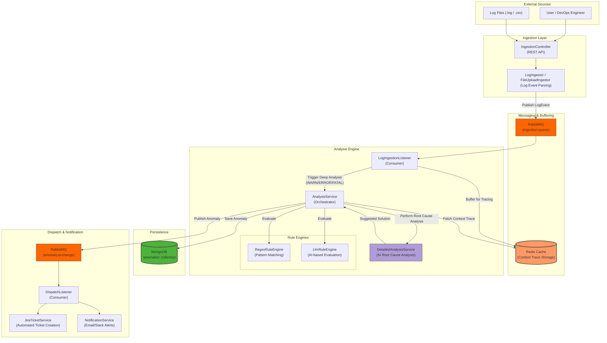

# Project Architecture Flow

This diagram represents the end-to-end flow of logs from ingestion to AI-powered analysis and Jira ticket creation.

```mermaid
graph TD
    subgraph "External Sources"
        LogFiles["Log Files (.log / .csv)"]
        User["User / DevOps Engineer"]
    end

    subgraph "Ingestion Layer"
        IC["IngestionController <br/>(REST API)"]
        LI["LogIngestor / FileUploadIngestor <br/>(Log Event Parsing)"]
    end

    subgraph "Messaging & Buffering"
        RMQ1["RabbitMQ <br/>(ingestion.queue)"]
        REDIS[("Redis Cache <br/>(Context Trace Storage)")]
    end

    subgraph "Analysis Engine"
        LIL["LogIngestionListener <br/>(Consumer)"]
        AS["AnalysisService <br/>(Orchestrator)"]
        subgraph "Rule Engines"
            RRE["RegexRuleEngine <br/>(Pattern Matching)"]
            LRE["LlmRuleEngine <br/>(AI-based Evaluation)"]
        end
        DAS["DetailedAnalysisService <br/>(AI Root Cause Analysis)"]
    end

    subgraph "Persistence"
        MONGO[(MongoDB <br/> 'anomalies' collection)]
    end

    subgraph "Dispatch & Notification"
        RMQ2["RabbitMQ <br/>(anomaly.exchange)"]
        DL["DispatchListener <br/>(Consumer)"]
        JTS["JiraTicketService <br/>(Automated Ticket Creation)"]
        ENS["NotificationService <br/>(Email/Slack Alerts)"]
    end

    %% Flow Connections %%
    User --> IC
    LogFiles --> IC
    IC --> LI
    LI -->|Publish LogEvent| RMQ1
    RMQ1 --> LIL
    
    LIL -->|"Buffer for Tracing"| REDIS
    LIL -->|"Trigger Deep Analysis <br/>(WARN/ERROR/FATAL)"| AS
    
    AS -->|Evaluate| RRE
    AS -->|Evaluate| LRE
    
    AS -->|"Fetch Context Trace"| REDIS
    AS -->|"Perform Root Cause Analysis"| DAS
    DAS -->|"Suggested Solution"| AS
    
    AS -->|"Save Anomaly"| MONGO
    AS -->|"Publish Anomaly"| RMQ2
    
    RMQ2 --> DL
    DL --> JTS
    DL --> ENS

    %% Styling %%
    style REDIS fill:#f96,stroke:#333,stroke-width:2px
    style MONGO fill:#4db33d,stroke:#333,stroke-width:2px
    style RMQ1 fill:#ff6600,stroke:#333
    style RMQ2 fill:#ff6600,stroke:#333
    style DAS fill:#b19cd9,stroke:#333
```
